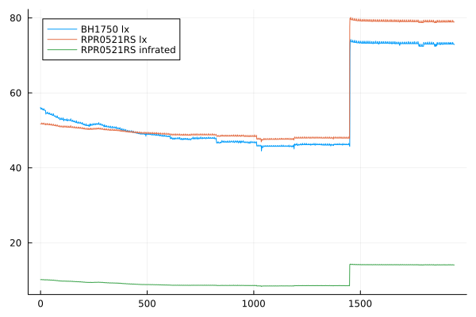

= i483 中間レポート(データまとめ)

== 計測環境

* 学生寄宿舎，自室のデスクの隅
  (あまりデスクライトが届いていない)
* 18:00から24:00頃

== 課題1

=== 1.1

* RPR0521RSを使ったesp-idfによる計測
* センサ設定
    * LED current 200mA
    * Gain x64

    79.015625 lx (infrated: 14.128906)
    79.015625 lx (infrated: 14.128906)
    79.011719 lx (infrated: 14.128906)
    79.011719 lx (infrated: 14.128906)
    79.015625 lx (infrated: 14.128906)
    79.011719 lx (infrated: 14.128906)
    79.015625 lx (infrated: 14.128906)
    79.015625 lx (infrated: 14.128906)
    79.011719 lx (infrated: 14.125000)
    79.015625 lx (infrated: 14.128906)
    79.015625 lx (infrated: 14.128906)
    79.011719 lx (infrated: 14.128906)
    79.015625 lx (infrated: 14.125000)
    79.015625 lx (infrated: 14.128906)
    79.015625 lx (infrated: 14.128906)
    79.015625 lx (infrated: 14.128906)
    79.011719 lx (infrated: 14.128906)
    79.015625 lx (infrated: 14.125000)
    79.007812 lx (infrated: 14.128906)
    79.015625 lx (infrated: 14.128906)
    79.011719 lx (infrated: 14.128906)
    79.015625 lx (infrated: 14.128906)
    79.015625 lx (infrated: 14.128906)
    79.015625 lx (infrated: 14.128906)
    79.015625 lx (infrated: 14.132812)
    79.015625 lx (infrated: 14.128906)
    79.011719 lx (infrated: 14.128906)
    79.011719 lx (infrated: 14.128906)
    79.011719 lx (infrated: 14.128906)
    79.015625 lx (infrated: 14.125000)
    79.015625 lx (infrated: 14.128906)
    79.019531 lx (infrated: 14.128906)
    79.015625 lx (infrated: 14.132812)
    79.015625 lx (infrated: 14.128906)
    79.023438 lx (infrated: 14.128906)
    79.023438 lx (infrated: 14.132812)
    79.011719 lx (infrated: 14.128906)
    79.015625 lx (infrated: 14.128906)
    79.011719 lx (infrated: 14.132812)
    79.011719 lx (infrated: 14.128906)
    79.011719 lx (infrated: 14.128906)
    79.019531 lx (infrated: 14.128906)
    79.015625 lx (infrated: 14.125000)
    79.011719 lx (infrated: 14.128906)
    79.011719 lx (infrated: 14.125000)
    79.019531 lx (infrated: 14.128906)
    79.015625 lx (infrated: 14.128906)
    79.015625 lx (infrated: 14.128906)
    79.011719 lx (infrated: 14.128906)
    79.015625 lx (infrated: 14.128906)
    79.011719 lx (infrated: 14.132812)
    79.023438 lx (infrated: 14.128906)
    79.015625 lx (infrated: 14.128906)
    79.011719 lx (infrated: 14.128906)
    79.015625 lx (infrated: 14.128906)
    79.015625 lx (infrated: 14.132812)
    79.011719 lx (infrated: 14.128906)
    79.011719 lx (infrated: 14.128906)
    79.011719 lx (infrated: 14.128906)
    79.023438 lx (infrated: 14.128906)
    79.019531 lx (infrated: 14.132812)
    79.023438 lx (infrated: 14.128906)

=== 1.2

* MicroPythonによるSCD41を使った計測
* センサ設定: デフォルト

    1971 ppm, 22.40444 °C, 67.85229 RH
    2143 ppm, 22.42847 °C, 68.82735 RH
    2274 ppm, 22.30831 °C, 69.52773 RH
    2381 ppm, 22.1748 °C, 70.15335 RH
    2435 ppm, 22.04662 °C, 70.8629 RH
    2471 ppm, 21.93179 °C, 71.45342 RH
    2485 ppm, 21.82765 °C, 72.04242 RH
    2493 ppm, 21.71282 °C, 72.59632 RH
    2496 ppm, 21.63805 °C, 73.05562 RH
    2502 ppm, 21.56062 °C, 73.52102 RH
    2502 ppm, 21.50187 °C, 73.96811 RH
    2504 ppm, 21.44846 °C, 74.37705 RH
    2508 ppm, 21.36568 °C, 74.70512 RH
    2510 ppm, 21.31495 °C, 75.02403 RH
    2512 ppm, 21.26688 °C, 75.31396 RH
    2514 ppm, 21.23217 °C, 75.52911 RH
    2516 ppm, 21.20013 °C, 75.81903 RH
    2531 ppm, 21.16274 °C, 76.02502 RH
    2531 ppm, 21.13069 °C, 76.2005 RH
    2532 ppm, 21.12268 °C, 76.36073 RH
    2532 ppm, 21.10666 °C, 76.49195 RH
    2535 ppm, 21.06393 °C, 76.59418 RH
    2535 ppm, 21.06927 °C, 76.71168 RH
    2539 ppm, 21.05859 °C, 76.7773 RH
    2540 ppm, 21.07462 °C, 76.84901 RH
    2540 ppm, 21.04524 °C, 76.90852 RH
    2541 ppm, 21.05325 °C, 76.98177 RH
    2541 ppm, 21.0666 °C, 77.02144 RH
    2541 ppm, 21.06126 °C, 77.02296 RH
    2542 ppm, 21.07195 °C, 77.06416 RH
    2541 ppm, 21.07195 °C, 77.09621 RH
    2540 ppm, 21.06393 °C, 77.08705 RH
    2541 ppm, 21.0666 °C, 77.11757 RH
    2541 ppm, 21.07195 °C, 77.08553 RH
    2541 ppm, 21.07996 °C, 77.07332 RH
    2542 ppm, 21.09331 °C, 77.0489 RH
    2542 ppm, 21.09865 °C, 77.07942 RH
    2545 ppm, 21.10666 °C, 77.04585 RH
    2546 ppm, 21.12802 °C, 77.00008 RH
    2547 ppm, 21.13336 °C, 76.95583 RH
    2547 ppm, 21.14939 °C, 76.94209 RH
    2547 ppm, 21.16007 °C, 76.96193 RH
    2552 ppm, 21.17609 °C, 76.89479 RH
    2552 ppm, 21.18143 °C, 76.87343 RH

=== 1.3

2と兼ねる

== 課題2

* 使用言語: Rust
    ** HALはesp-idf-svcを用いた
* RPR0521RSの設定
    ** LED current: 200mA
    ** Gain x64
* BH1750の設定
    ** One Time H-Resolution Mode2
    ** MTReg: 0xfe
        *** one count = 0.11 lx
* DPS310の設定
    ** coefficient source: external temperature sensor
    ** oversampling 64 times
* SCD41の設定: デフォルト
* データ: `{repository_root}/data/data.csv`
* 横軸: 計測回数

